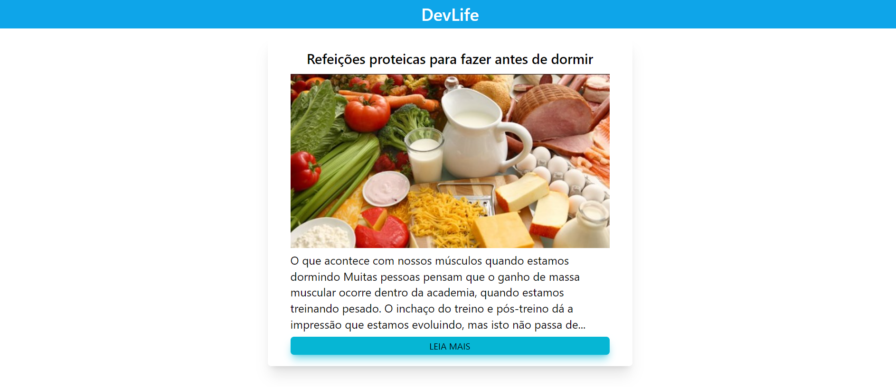
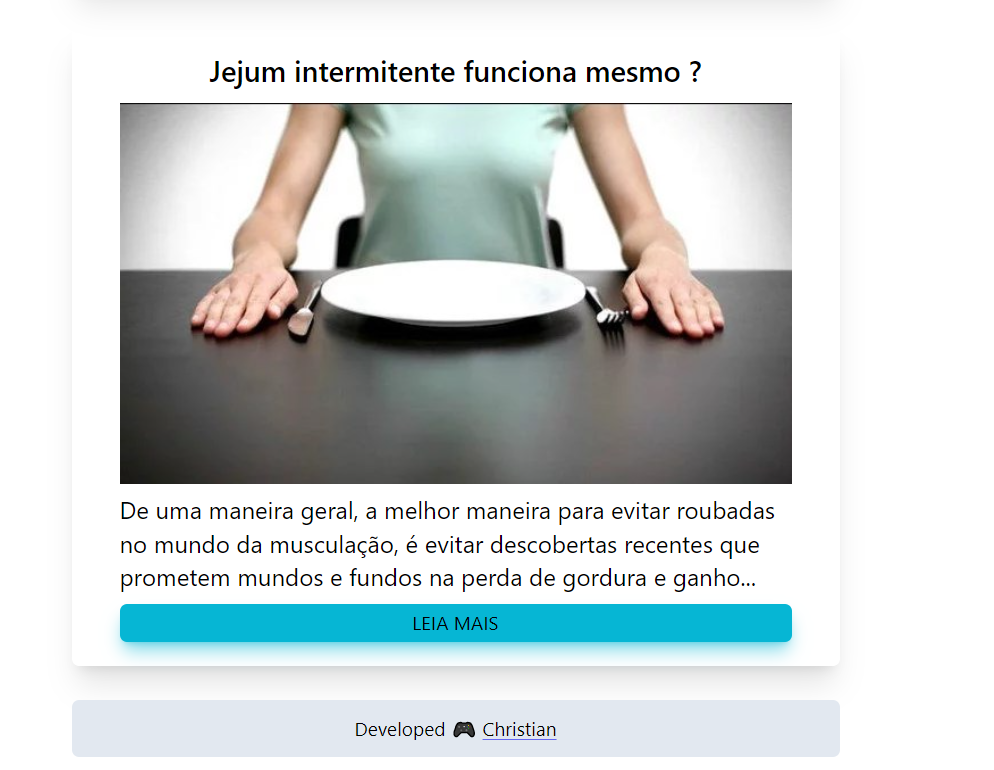
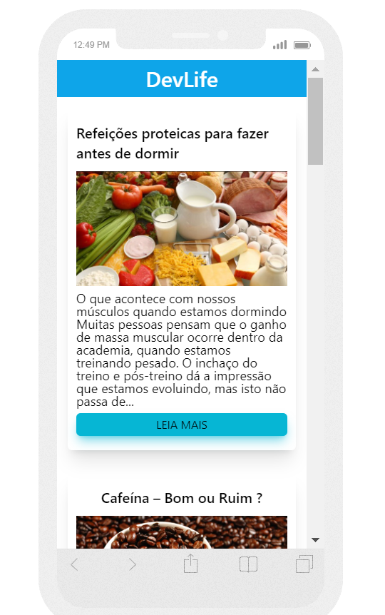
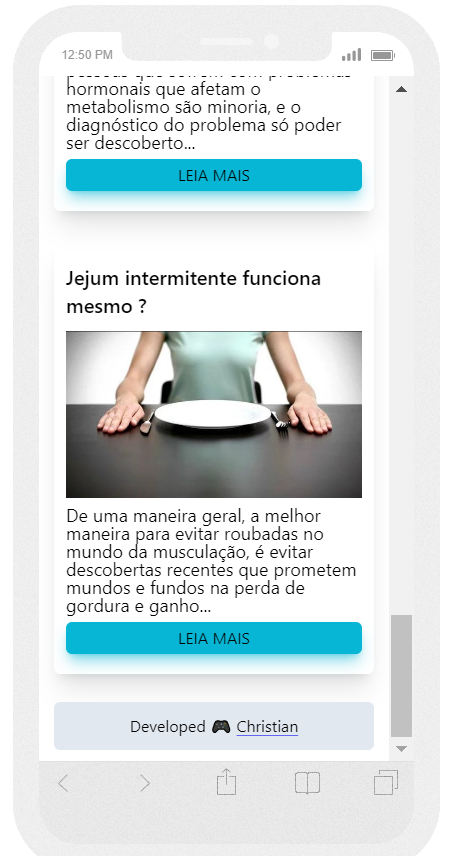
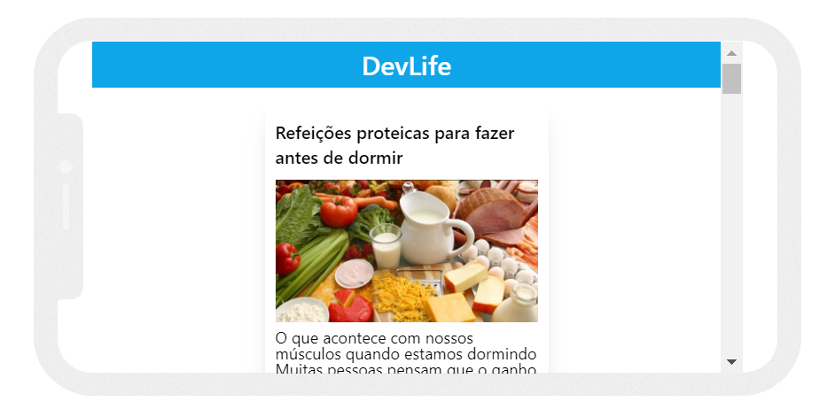
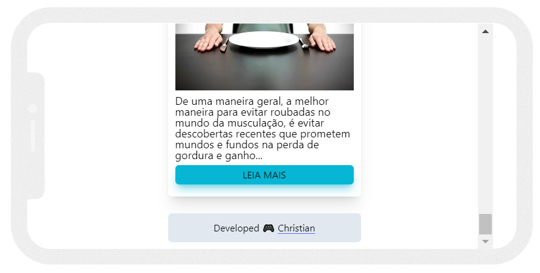

# DevLife

## Table of contents

- [Overview](#overview)
  - [How to run the project](#How-to-run-the-project)
  - [The objectives](#the-objectives)
  - [Solution link](#Solution-link)
  - [Solution video](#Solution-video)
  - [Screenshot](#screenshot)
- [My process](#my-process)
  - [Built with](#built-with)
  - [What I learned](#what-i-learned)
- [Author](#author)

## Overview

### The objectives

- Create a responsive ReactJS web application that consumes an existing API.

### How to run the project

### Solution link

[Click here to go to the project](https://christian-m-silva.github)

### Solution video

[Click here to go to the video](https://youtu.be/lkvEMKLPHUk)

### Screenshot

Desktop   

Mobile Portrait  

Mobile Landscape 

## My process

### Built with

- Semantic HTML5 markup
- Tailwindcss
- ReactJS
- Axios
- useState
- useEffect
- API consumption

### What I learned

I learned how to use axios, useEffect and useState inside ReactJS to consume an API and return information from that API in my project.

## Author

- Name - Christian
- Instagram - [@apredizti](https://www.instagram.com/apredizti/)
- Linkedin - [@Christian Silva]( https://www.linkedin.com/in/christian-silva-83172621a)
- GitHub - [@Christian Silva](https://github.com/Christian-M-Silva)